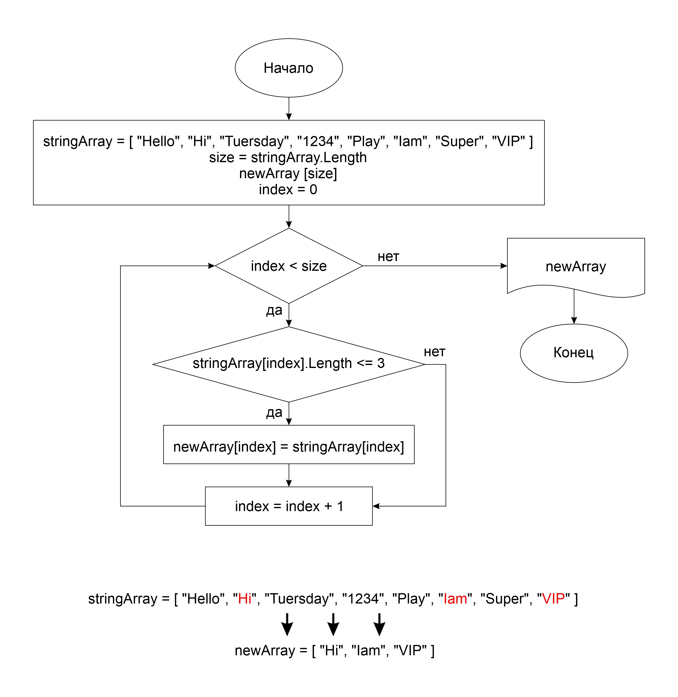

# Текстовое описание решения

__`Задача:`__ Написать программу, которая из имеющегося массива строк формирует массив из строк, длинна которых меньше либо равна 3 символа.
Первоначальный массив можно ввести с клавиатуры, либо задать на старте выполнения алгоритма.

В данном итоговом задании представлено три варианта решения:

__`1-й вариант`__ - Массив задан, без метода, по блок-схеме
> Блок-схема представлена на рис.1

__`2-й вариант`__ - Массив задан, использован метод

__`3-й вариант`__ - Массив вводится с клавиатуры, есть проверка на ввод пустой строки или нуля
